# dialogflow-fulfillment-app-v2
Utilizado em Workshops de# DialogFlow Fulfillment

Este é o projeto base para o Hands-On desenvolvido pela [CrudTec](https://crudtec.com.br) para fins de estudo.

Contribuições no projeto são bem-vindas.

## O que é o "Fulfillment" ?

O termo se refere à funcionalidade de consumir informação de forma dinâmica durante o fluxo do chatbot, por exemplo mostrar a cotação do dólar.

No exemplo do dólar, sabemos que essa informação muda a todo momento e por isso precisamos consumir ela de uma API externa que devolva essa informação atualizada automaticamente, essa é uma regra de negócio dinâmica na aplicação. Usando o Fulfillment conseguimos atender ela sem problemas.

No DialogFlow podemos utilizar o Fulfillment "Inline" ou "Webhook".

- **Inline**

    Nesse tipo podemos programar no próprio site do DialogFlow. Muito útil para pequenos fluxos ou fluxos simples.

    Utiliza a suíte de produtos Firebase by Google e por isso temos total liberdade dentro dos produtos Google, inclusive Google Cloud Plataform.

    Possui algumas desvantagens:
    
    - Só pode ser programado utilizando a linguagem JavaScript (NODE.JS);
    - Só existe um arquivo que pode ser programado (Não é possível criar várias classes/arquivos);
    - É difícil de debugar o código;
    - Na versão gratuita apenas os produtos do Google estão acessíveis.

- **Webhook**

    No WEBHOOK colocamos o link da nossa API ao invés do código pronto na página do DialogFlow.

    A API precisa atender aos padrões do DialogFlow de autenticação, payload, segurançam, etc.

    Pode ser programada em qualquer linguagem capaz de responder à requisições HTTP.

    Aqui pode-se utilizar quantas classes quiser, por mais que o DialogFlow acesse apenas uma API independente da intenção, do lado da API, é possível tomar a decisão de pra onde essa requisição deve ser enviada, uma vez que ela recebe o nome da itenção.

    Possui algumas desvantagens:

    - Mais difícil de implementar;
    - Precisa ter autenticação na API ao menos em nível básico;


O Fulfillment pode receber, e na maioria das vezes deve receber, parâmetros digitados pelo usuário na conversa. Geralmente esses parâmetros são as intenções, entidades de sistema, desenvolvedor ou sessão.

## Mão na massa

Agora que já sabemos tudo sobre Fulfillment vamos colocar a mão na massa:

**Vamos criar um Fulfillment capaz de criar eventos no Google Calendar para uma Clínica Médica**

A regra de negócio será bem simples. O paciente pode agendar consulta com qualquer especialista cadastrado nas entidades do DialogFlow. Os parâmetros obrigatórios para nosso Fulfillment são:

- Dia da consulta
- Horário da consulta
- Especialidade da consulta

Nossa clínica será 24 horas. Podem haver vários agendamentos para um mesmo horário desde que sejam agendamentos para especialidades diferentes. Caso o horário esteja disponível, será feito o agendamento na agenda da clínica. Caso o horário desejado já possua agendamento deve-se então tentar achar outro horário para o paciente e responder com as alternativas. Assim o fluxo neste exemplo começará novamente.

**Vamos utilizar o Fulfillment Inline com um código simples para facilitar o entendimento**

1) Ative o Fulfillment no DialogFlow:

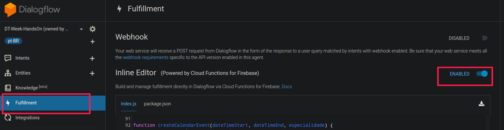

2) Na sessão package.json coloque as dependências. Basta copiar o código do arquivo [package.json](https://github.com/crudtec/dialogflow-fulfillment-app-v2/blob/master/package.json) deste repositório e substitua.


3) Ao lado da sessão package.json cliquem em index.js e copie o código do arquivo [index.js](https://github.com/crudtec/dialogflow-fulfillment-app-v2/blob/master/index.js) deste repositório e substitua.

4) Clique no botão de "Deploy" do Editor. Essa ação de deploy pode levar mais de 1 minuto.

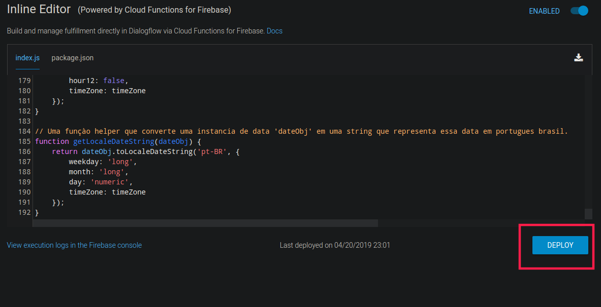

----

**Agora que o código está salvo precisamos preencher algumas variáveis que estão nele:** 

```javascript
// ....

// ## Insira o código do seu calendário criado.
const calendarId = ''; // Exemplo: 6ujc6j6rgfk02cp02vg6h38cs0@group.calendar.google.com

// ## Insira a sua chave de integração com o Google Calendar
const serviceAccount = {}; // Esse objeto JSON parece com: { "type": "service_account", ... }


// ....
```

A primeira variável vamos conseguir criando um calendário no Google Calendário.

A segunda vamos conseguir criando um novo serviço de API no Google Cloud.

----

Continuemos:

5) Abra o [Google Calendar](http://google.com) e na barra lateral procure a opção e clique em "Criar nova agenda":

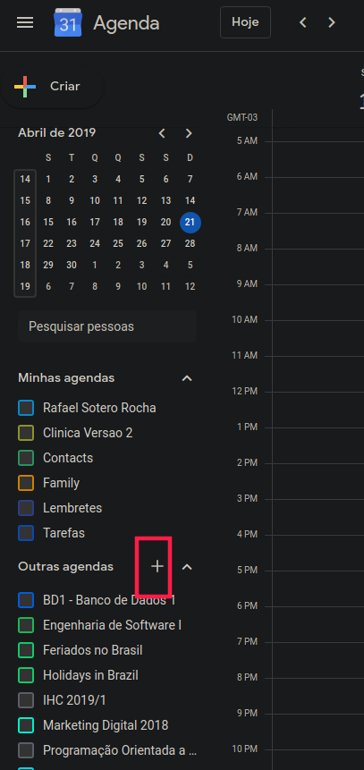

6) Dê um nome para sua Agenda, por exemplo: "Clínica Médica" e clique em "Criar Agenda".

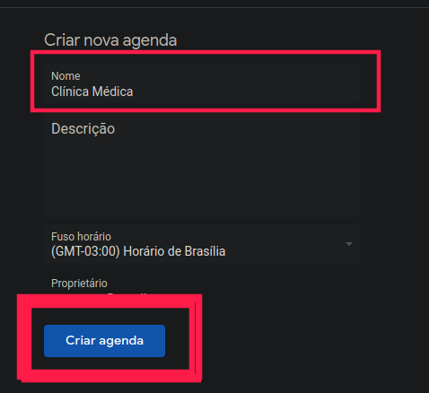

7) Com a agenda criada volte para a página inicial do Google Calendar, deixe apenas a agenda criada selecionada. Clique sobre os três pontos e vá até a opçào de configurações.

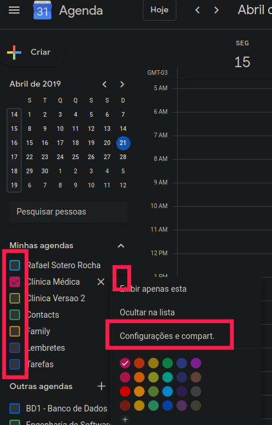

8) Já na parte de configurações na sessão "Integrar Agenda" você encontra o ID da Agenda, é ele que será utilizado para preencher a variável "calendarId".

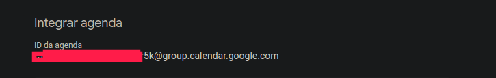

**Em uma nova aba volte para a página do Fulfillment no Dialogflow e coloque essa informação no código:**

```javascript
// ....

// ## Insira o código do seu calendário criado.
const calendarId = 'SEU_ID_GOOGLE_CALENDAR@group.calendar.google.com'; // Exemplo: 6ujc6j6rgfk02cp02vg6h38cs0@group.calendar.google.com

// ....
```

**NÃO ESQUEÇA DE APERTAR O BOTÃO DE DEPLOY PARA SALVAR SEU CÓDIGO**


9) Ainda não feche a página de configurações do GOOGLE CALENDAR, em uma NOVA ABA, abra o DialogFlow e navegue até a opção de configuração e em seguida clique no ID do Google Cloud.

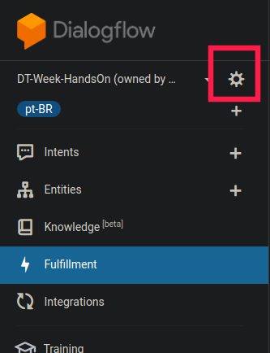

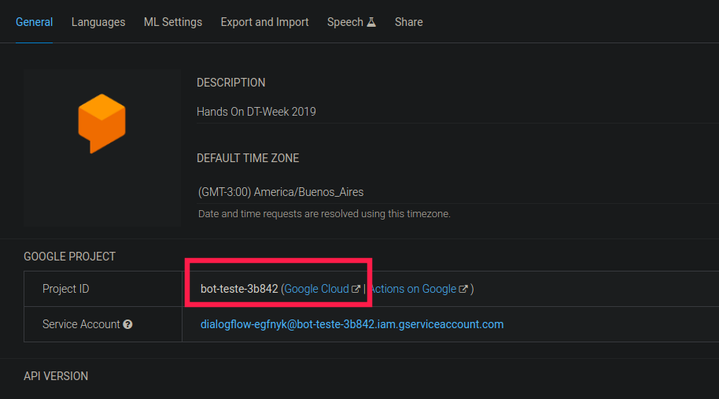

10) Com a página do Google Cloud Aberta siga as orientações para ativar a API do Google Calendar e criar uma nova chave de autenticação na sua agenda.

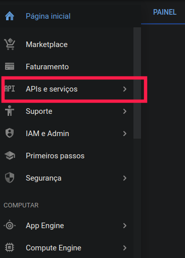
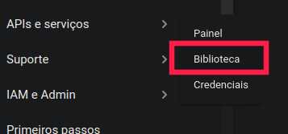
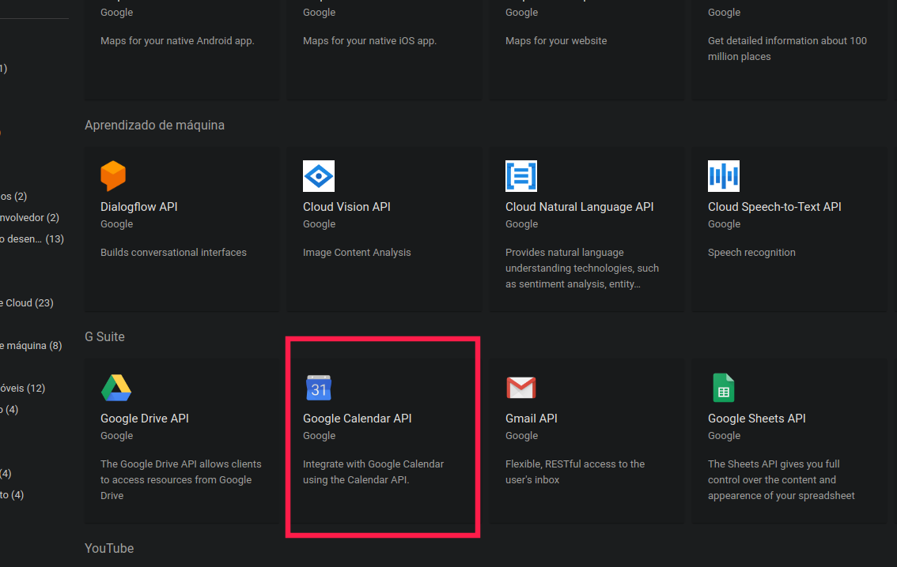
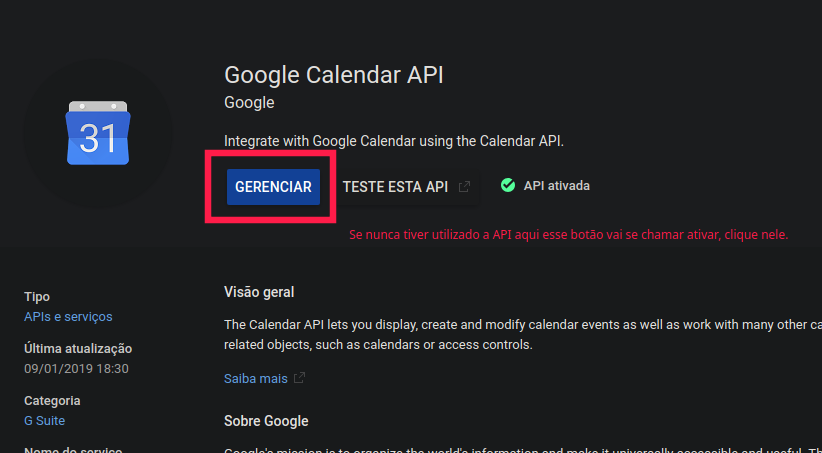
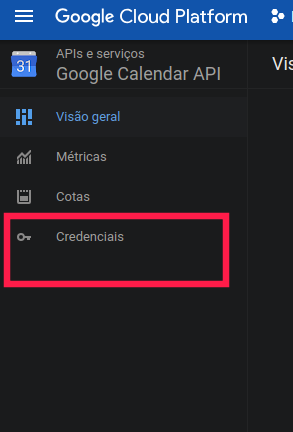

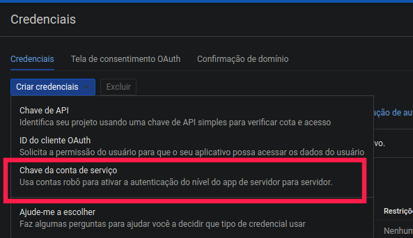
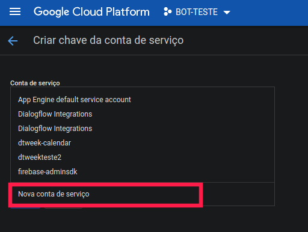
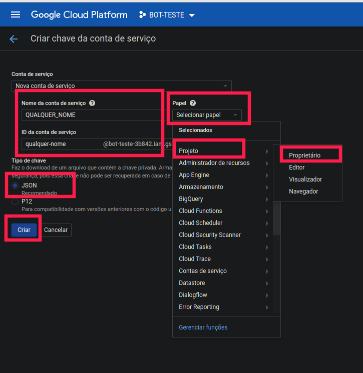
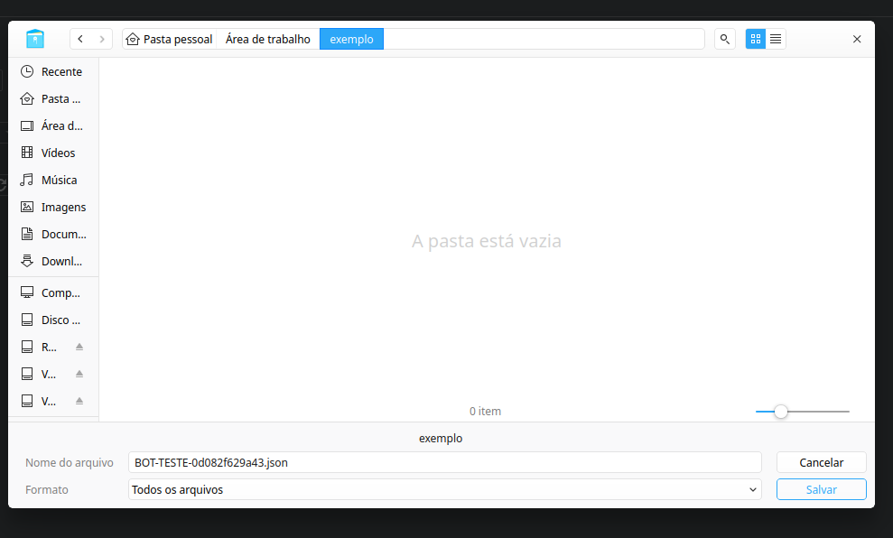


Após seguir cuidadosamente os passos acima temos a chave da nossa api para substituir na segunda variavel, abra o arquivo de texto baixado no ultimo passo, copie todo seu conteúdo e coloque na segunda variável.

```javascript
// ....

// ## Insira a sua chave de integração com o Google Calendar
const serviceAccount = { "type": "service_account", ... }; // Esse objeto JSON parece com: { "type": "service_account", ... }


// ....
```

Na tela do Fulfillment no DialogFlow clique em Deploy depois de fazer as alterações.

10) Dentro do arquivo de texto existe a conta de e-mail sistêmica que criamos que precisa ter acesso de alteração em nosso calendário.

```json
"client_email": "qualquer-nome@bot-teste-3b842.iam.gserviceaccount.com",
```

Copie o seu client_email e volte para a tela de configuração do google calendar.

Nessa tela, na opção "Compartilhar com pessoas específicas" adicione o endereço de e-mail do client_email conforme a imagem abaixo, atenção para as PERMISSÕES:

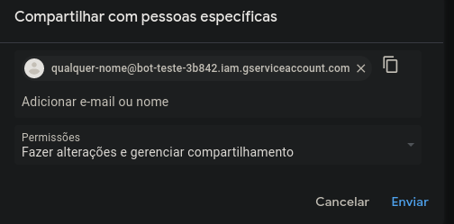

E clique em enviar.


11) Por último, mas não menos importante, verifique se a seguinte linha corresponde ao nome da sua itenção que manda data, hora e especialista para seu Fulfillment:

```javascript
intentMap.set('SUA INTENCAO AQUI', makeAppointment); // Essa parte mapeia a intenção 'SUA INTENCAO AQUI' para a funcao 'makeAppointment()'. Substitua 'SUA INTENCAO AQUI' pela sua intenção do DialogFlow.

```

Caso não, substitua o nome entre aspas simples.

Também verifique se sua intenção está chamando fulfillment quando executada na tela de intenção no DialogFlow:

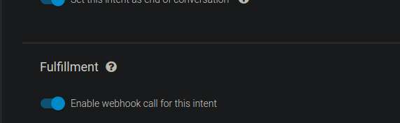


## Finalizando

É com prazer que informo que concluímos nosso hands on. Vamos testar? BOTs Inteligentes

## Como Contribuir?

1. 🍴 Faça um Fork neste repo [aqui](https://github.com/crudtec/dialogflow-fulfillment-app-v2#fork-destination-box)
2. 🔨 Faça suas contribuições
3. 👥 Adicione seu nome e seu perfil nos créditos
4. 🔧 Faça um pull request [aqui](https://github.com/crudtec/dialogflow-fulfillment-app-v2/compare)
5. 🎉 Analisamos as constribuições e aprovamos! Sucesso!

Ou se quiser [crie issues](https://github.com/crudtec/dialogflow-fulfillment-app-v2/issues) para melhorarmos o projeto! 😊

## Créditos 
[](https://sourcerer.io/fame/wladneto/wladneto/dialogflow-fulfillment-app-v2/links/0)[](https://sourcerer.io/fame/wladneto/wladneto/dialogflow-fulfillment-app-v2/links/1)[](https://sourcerer.io/fame/wladneto/wladneto/dialogflow-fulfillment-app-v2/links/2)[](https://sourcerer.io/fame/wladneto/wladneto/dialogflow-fulfillment-app-v2/links/3)[](https://sourcerer.io/fame/wladneto/wladneto/dialogflow-fulfillment-app-v2/links/4)[](https://sourcerer.io/fame/wladneto/wladneto/dialogflow-fulfillment-app-v2/links/5)[](https://sourcerer.io/fame/wladneto/wladneto/dialogflow-fulfillment-app-v2/links/6)[](https://sourcerer.io/fame/wladneto/wladneto/dialogflow-fulfillment-app-v2/links/7)

- [CrudTec] (https://github.com/crudtec/)
- [Rafael Sotero](https://github.com/soterocra) 
- [Wladimir Neto](https://github.com/wladneto)

ou  falecom@crudtec.com.br

